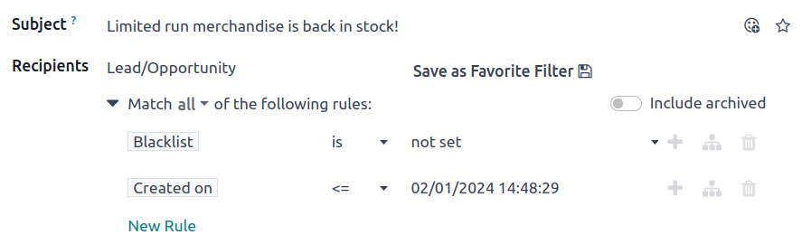
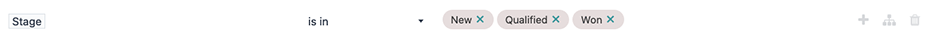
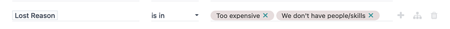
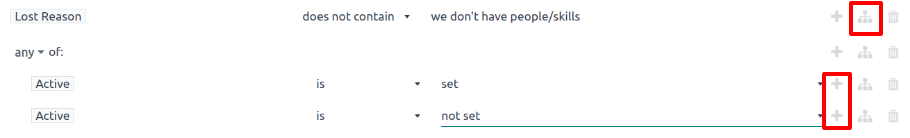

=============================
Lost leads reactivation email
=============================

In Odoo, lost leads are removed from the active *CRM* pipeline, but can still be targeted with the
*Email Marketing* application for strategic campaign use such as lost leads reactivation.

A lost leads reactivation email looks at the leads that were lost during a specific period of time,
and uses a few custom filters and lost reasons to exclude undesirable leads from the mailing list.

Once a lost leads reactivation email is complete, it can be sent as is, modified and sent to
different groups for A/B testing, or saved as a template for later.

.. example::
   A warehouse has leftover merchandise from a limited run of items from last year. To help clear
   out the excess inventory, the warehouse manager creates a lost leads email to reach out to old
   opportunities that were lost, and inform them that the limited merchandise is back in stock.

   The warehouse manager uses the following filters for a lost leads email:

   - :guilabel:`Blacklist` *is* `not set`
   - :guilabel:`Created on` *>=* `01/01/2024 00:00:01`
   - :guilabel:`Stage` *is not in* `New`, `Qualified`, or `Won`
   - :guilabel:`Lost Reason` *is in* `Not enough stock`
   - and either :guilabel:`Active` *is* `set` or `not set`

   .. image:: lost_leads_email/example.png
      :align: center
      :alt: A lost leads reactivation filter list excluding lost reasons like Too Expensive.

.. tip::
   As filters are added and removed, pay attention to the :guilabel:`# record(s)` value below the
   filtering section. This value indicates the total number of records that match the current
   criteria.

   To view a list of all matching records, click the :guilabel:`# record(s)` text.

   .. image:: lost_leads_email/records.png
      :align: center
      :alt: The # record(s) text is located below the list of Recipient filters.

.. _create_email:

Minimum requirements
====================

In order to create and deliver a lost leads reactivation email campaign, the *CRM* and *Email
Marketing* applications must be :doc:`installed <../../general/apps_modules>` and configured.

Here are the minimum necessary filters that pertain to a lost leads reactivation mailing campaign:

- A **Blacklist** filter to exclude unsubscribed recipients
- A **Created on** filter to target leads that were lost during a specific period of time
- **Stage** filter(s) to exclude leads that were already won or are still active in new stages of
  the sales pipeline (i.e., *New*, *Qualified*, etc.). These values will be different per
  organization, however it's minimally viable to exclude all the leads in the *Won* stage.
- One or more **Lost Reason** filters to exclude undesired leads, such as duplicate, spam, or
  irrelevant records.
- A pair of **Active** filters to target *both* active and inactive leads

Add the necessary filters
=========================

First, navigate to the *Email Marketing* app, and on the :guilabel:`Mailings` page, click the
:guilabel:`New` button in the top-left corner.

On the new :guilabel:`Mailings` form, enter an appropriate :guilabel:`Subject` line for the email in
the corresponding field. Then in the :guilabel:`Recipients` field, choose the
:guilabel:`Lead/Opportunity` model from the drop-down menu.

In the rules section, click the modify filter (:guilabel:`▶ (triangle pointing right)`) icon, below
the :guilabel:`Recipients` field, to expand the filter rules. Leave the default
:guilabel:`Blacklist` rule in place.

Created on
----------

Begin by clicking and :guilabel:`New Rule` and select the :guilabel:`Created on` parameter in the
new rule's first field, from the drop-down menu, to designate a specific time period during which
the targeted leads were lost (i.e. 30 days prior, 90 days prior, previous year, etc.).

Then, in the second field, select a date operator :guilabel:`<= (less than or equal to)`,
:guilabel:`>= (greater than or equal to)`, or :guilabel:`is between` in order to frame the time
selection chosen in the third field.

In the third field, use the calendar popover window to select dates, and click :guilabel:`Apply` to
lock in the time range.

.. important::
   When there is more than one rule applied, make sure the statement at the top of the
   :guilabel:`Recipients` filter list reads :guilabel:`Match all of the following rules`. If it does
   not, click on the statement, and select :guilabel:`all` from the drop-down menu (as opposed to
   :guilabel:`any`).

   .. image:: lost_leads_email/match-all.png
      :align: center
      :alt: The statement at the top of the filters list, with the drop-down menu open.

Stage
-----

Now add :guilabel:`Stage` filter to exclude leads in the *New*, *Qualified*, and *Won* stages of
the sales pipeline.

.. note::
   This step assumes that the *New*, *Qualified*, and *Won* stages exist in the CRM pipeline,
   however stage names may differ from business to business. Refer to the database's actual stage
   names in the *CRM* app's pipeline to complete this step, accordingly.

Begin again by clicking :guilabel:`New Rule` and selecting :guilabel:`Stage` from the first field's\
drop-down menu. In the second field, select the :guilabel:`is not in` operator, and in the third
field, select the :guilabel:`New`, :guilabel:`Qualified` and :guilabel:`Won` stages to define the
rule's parameters.

When the rule is added in this way, the logic in the third field renders as OR (`|`) statements.

.. tip::
   Another way to add *Stage* rules, is to do so on a one-rule-per-row basis using the
   :guilabel:`contains` or :guilabel:`does not contain` operators, and manually typing out the
   defining characters in each stage name. This method, however, only allows for one selection at a
   time, which can be useful for quickly turning on/off filters in the :guilabel:`Search...` bar.

   .. image:: lost_leads_email/stages.png
      :align: center
      :alt: Three filter rules requiring that the Stage does not contain New, Qualified, or Won.

Lost Reason
-----------

Next, add one or more :guilabel:`Lost Reason` rules to exclude leads that should not be targeted for
specific :doc:`lost reasons <../../sales/crm/pipeline/lost_opportunities>`.

Create another :guilabel:`New Rule`, and in the rule's first field, select :guilabel:`Lost Reason`
from the drop-down menu. For the operator, choose either :guilabel:`is not in` or :guilabel:`does
not contain` from the drop-down menu. With either selection, use the third field to enter a lost
reason (or multiple lost reasons, depending on your operator choice) to include in the rule.

If choosing the :guilabel:`does not contain` operator, then repeat the preceding steps to add more
lost reasons, as needed, where each lost reason occupies one rule row at a time.

For more information, refer to the section below outlining how to :ref:`select appropriate lost
reasons <email_marketing/select_lost_reasons>`.

Active
------

Finally, add a pair of :guilabel:`Active` filters to include both active and inactive leads for the
campaign.

.. important::
   Adding both active **and** inactive lead records is necessary to capture the full scope of lost
   leads in the database. Doing one without the other greatly impacts the number of targetable
   records for the email campaign, and will not include a complete or accurate lost leads audience.

Click the :guilabel:`(Add Branch)` icon to the right of the latest rule's row to add a pair of
:guilabel:`any of` rules. In the top rule's first field, select the :guilabel:`Active` parameter
from the drop-down menu. The rule will then automatically fill out to read: :guilabel:`Active` *is*
`set`.

For the first field of the bottom rule, once more, select :guilabel:`Active` from the drop-down
menu and, this time, select :guilabel:`is not` from the operator drop-down menu, so the rule reads:
:guilabel:`Active` *is not* `set`.

Add body content
================

Now, with the domain section of the email campaign complete, create the body content of the email
using any of the premade stylized templates, or choose between the :guilabel:`Plain Text` or
:guilabel:`Start From Scratch` options for more granular control. For more information, refer to the
*Email Marketing* :ref:`documentation on how to create an email <email_marketing/create_email>`.

.. tip::
   To save the set of filters for later use, click :guilabel:`Save as Favorite Filter 💾`, enter a
   name (such as `Lost Leads`), and click :guilabel:`Add`.

   .. image:: lost_leads_email/favorite-filter.png
      :align: center
      :alt: The Save as Favorite Filter pop-up can save the lost leads criteria for later.

Send or schedule
================

Once all the components of the email campaign are complete:

- Click the purple :guilabel:`Send` button at the top-left of the form to immediately send the
  email;

  OR
- Click gray :guilabel:`Schedule` button, located to the right of the :guilabel:`Send` button, to
  send the email at a future date and time.

.. tip::
   Consider using A/B Testing to send an alternate version of the email to a percentage of the
   target leads. This can help determine what subject lines and body content produce the best
   click-through rates before sending a final version to the remaining leads.

   To do so, open the :guilabel:`A/B Tests` tab and check the box next to :guilabel:`Allow A/B
   Testing`. Adjust the parameters as needed, and click :guilabel:`Create an Alternative Version`.

   .. image:: lost_leads_email/ab-testing.png
      :align: center
      :alt: The A/B Tests tab with the Allow A/B Testing box checked to create an alternate version.

.. _email_marketing/select_lost_reasons:

Select appropriate lost reasons
===============================

When a lead is marked as lost, Odoo recommends selecting a *Lost Reason* to indicate why the
opportunity did not result in a sale. Doing so keeps the pipeline organized and reporting data
accurate, and also generates potential to follow up with the lead in the future.

If an existing *Lost Reason* is not applicable, users with the necessary permissions can create new
ones, which means the lost reasons in a database vary from organization to organization and pipeline
to pipeline. For more information on *Lost Reasons*, including the creation of them, refer to
:doc:`../../sales/crm/pipeline/lost_opportunities`.

By default, Odoo does include a few common reasons such as:

- *Too expensive*
- *We don't have people/skills*
- *Not enough stock*

When determining which reasons to include in a lost leads reactivation email, consider what the
email is advertising in order pinpoint one or more relevant lost reasons. Then add a rule stating
:guilabel:`Lost Reason` *does not contain* `_____` for every reason in the database **except** for
the relevant one(s).

.. example::
   If the email advertises a selection of previously limited merchandise that is now back in stock,
   it makes sense to target leads with the lost reason: *not enough stock*.

   .. image:: lost_leads_email/out-of-stock.png
      :align: center
      :alt: A list of filter rules that exclude all lost reasons except for Out of Stock.

   If the email advertises a price reduction, it makes sense to target leads with the lost reason:
   *too expensive*.

   .. image:: lost_leads_email/too-expensive.png
      :align: center
      :alt: A list of filter rules that exclude all lost reasons except for Too Expensive.

.. _analyze_results:

Analyze the results
===================

After sending a lost leads reactivation email, marketing teams can use the smart buttons along the
top of the email to analyze the results and determine follow-up actions.

Clicking on any of the smart buttons opens a list of the records matching that button's specific
criteria.

.. image:: lost_leads_email/smart-buttons.png
   :align: center
   :alt: The Mailing page of a sent email showing the smart buttons along the top of the page.

The smart buttons include:

- :guilabel:`Sent`: the total number of emails that were sent.
- :guilabel:`Opened`: the percentage of recipients that opened the email.
- :guilabel:`Replied`: the percentage of recipients that replied to the email.
- :guilabel:`Clicked`: the click-through rate (%) of recipients that clicked on a link in the email.
- :guilabel:`Leads/Opportunities`: the number of leads (or opportunities) that have been created in
  the *CRM* pipeline as a result of the email campaign.
- :guilabel:`Quotations`: the number of quotations that have been created in the *Sales* application
  as a result of the email.
- :guilabel:`Invoiced`: the total revenues generated as a result of the email campaign, via invoices
  sent to and paid by customers. These values are recorded in either the *Invoicing* or *Accounting*
  application, depending on whichever is installed on the database.
- :guilabel:`Received`: the percentage of recipients that received the email.
- :guilabel:`Bounced`: the percentage of emails that bounced :dfn:`not delievered`
- :guilabel:`Ignored`: the number of recipients that received the email but have not interacted with
  it in a meaningful way (i.e. opened, clicked)

Email nurturing
===============

*Email nurturing* (sometimes referred to as *lead nurturing*) is the process of sending a series of
timely and relevant *nudge* emails to connect with a lead, build a deeper relationship, and
ultimately convert the lead into a sale.

The point of nurturing is to keep the email campaign "visible" or at the top of a lead's inbox until
they are ready to buy. There are many approaches to effective lead nurturing, but it often involves:

- Sending an initial email (such as a lost leads reactivation email).
- Sending a follow-up email each week (or according to specific triggers) for the duration of the
  campaign.
- Continuously analyzing the results to see what approaches have resulted in sales.
- Continuously adjusting the approach to remain "visible" at the top of the lead's inbox and get a
  meaningful response from the lead.

As a campaign progress, a marketing team may send different follow-up emails depending on how a lead
responded the previous week.

.. example::
   A marketing team wants to advertise a restocking of limited-run merchandise to all leads with a
   lost reason of *not enough stock*. They develop the following three-week long lead nurturing
   campaign.

   - **Week 1:** the marketing team sends an initial email with a subject line of *“Limited run
     merchandise is back in stock! Act now!”*
   - **Week 2:** the marketing team sends two different emails, depending on how a lead responded.

     - If a lead ignored the Week 1 email: *“Stock is almost out, did you get yours?”*
     - If a lead clicked on the Week 1 email: *"You still have time to add this to your collection"*

   - **Week 3:** the marketing team sends a final email to all leads who have not been converted
     stating *“20% off, don't miss your last chance to get these items before they're gone!”*

   Throughout the campaign, the marketing team continuously refers to the smart buttons along the
   top of the mailing page to see what percentages of leads are opening, clicking on, or ignoring
   the emails, as well as to report on how many opportunities, quotations, and invoices have been
   generated by the campaign.

.. seealso::
   - :doc:`../email_marketing`
   - :doc:`unsubscriptions`
   - :doc:`../marketing_automation`
