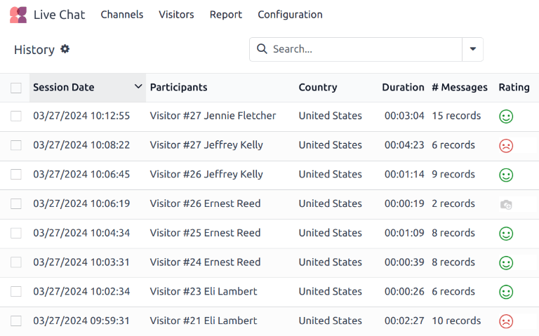
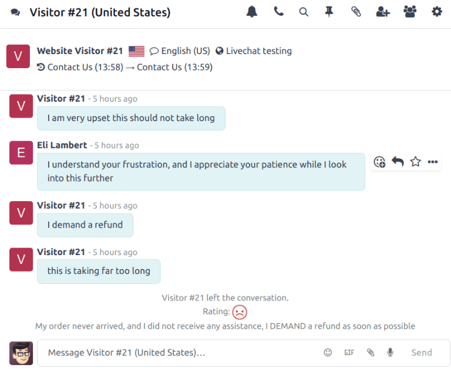
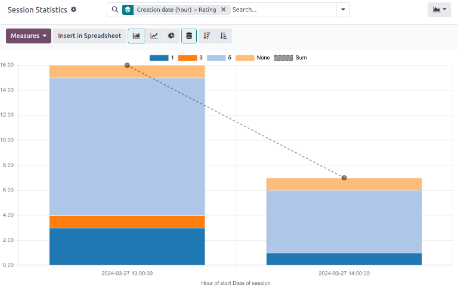
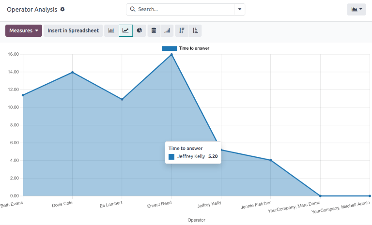

=======
Reports
=======

Odoo *Live Chat* includes several reports that allow for the monitoring of operator performance and
the identification of trends in customer conversations.

Available reports
=================

The *Live Chat* app features four reports:

- :ref:`Sessions History <livechat/sessions-history>`
- :ref:`Session Statistics <livechat/session-statistics>`
- :ref:`Operator Analysis <livechat/operator-analysis>`
- :doc:`Customer Ratings <../livechat/ratings>`

.. note::
   The *Live Chat Ratings Report* can also be accessed through the :guilabel:`Report` menu. For more
   information on this report, and on the *Live Chat* rating process, see :doc:`../livechat/ratings`

To access the available reports, navigate to the :menuselection:`Live Chat app --> Report menu`.

.. _livechat/sessions-history:

Sessions History
----------------

The *Sessions History* report displays an overview of live chat sessions, including participant
names, session dates, and the duration of the session. Select a conversation from the list and click
to open the *Discuss* app.

In the *Discuss* app, the conversation view displays the entire transcript of the conversation. At
the top of the conversation is a list of the web pages the visitor browsed before beginning their
chat session, with time stamps. If the visitor left a rating, it is included at the end of the
transcript.

.. _livechat/session-statistics:

Session Statistics
------------------

The *Session Statistics* provides a statistical overview of live chat sessions. The default view for
this report is to display sessions grouped by the date of creation.

   The stacked bar graph view of the Session Statistics report, with results grouped by Creation
   Date (hour), then by rating.

To view a different measure, click the :guilabel:`Measures` drop-down at the top-left of the report.
The measures available for this report include:

- :guilabel:`# of Speakers`: number of participants in the conversation.
- :guilabel:`Days of activity`: number of days since the operator's first session.
- :guilabel:`Duration of Session (min)`: the duration of a conversation, in minutes.
- :guilabel:`Is visitor anonymous`: denotes whether the conversation participant is anonymous.
- :guilabel:`Messages per session`: the total number of messages sent in a conversation. This
  measure is included in the default view.
- :guilabel:`Rating`: the rating received by an operator at the end of a session,if one was
  provided.
- :guilabel:`Session not rated`: denotes if a session did **not** receive a rating at the end of the
  conversation.
- :guilabel:`Time to answer (sec)`: the average time, in seconds, before an operator responds to a
  chat request.
- :guilabel:`Visitor is Happy`: denotes whether a positive rating was provided. If the visitor gave
  either a negative or neutral rating, they are considered *unhappy*.
- :guilabel:`Count`: the total number of sessions.

.. _livechat/operator-analysis:

Operator Analysis
-----------------

The *Operator Analysis* report is used to monitor the performance of individual live chat operators.
The default view for this report is a *bar chart*, which displays only conversations from this
month. Conversations are grouped by operator.

To view a different measure, click the :guilabel:`Measures` drop-down at the top-left of the report.
The measures available for this report include:

- :guilabel:`# of Sessions`: the number of sessions an operator participated in. This measure is
  included by default.
- :guilabel:`Average duration`: the average duration of a conversation, in seconds.
- :guilabel:`Average rating`: the average rating received by the operator.
- :guilabel:`Time to answer`: the average amount of time before the operator responds to a chat
  request.
- :guilabel:`Count`: the total number of sessions.

View and filter options
=======================

On any Odoo report, the view and filter options vary, depending on what data is being analyzed,
measured, and grouped. See below for additional information on the available views for the *Live
Chat* reports.

.. note::
   The :ref:`Sessions History <livechat/sessions-history>` report is **only** available in *list
   view*.

Pivot view
----------

The *pivot* view presents data in an interactive manner. The :ref:`Session Statistics
<livechat/session-statistics>` and :ref:`Operator Analysis <livechat/operator-analysis>` reports are
available in pivot view.

The pivot view can be accessed on a report by selecting the :guilabel:`grid icon` at the top-right
of the screen.

To add a group to a row or column to the pivot view, click the :guilabel:`➕ (plus sign)` next to
:guilabel:`Total`, and then select one of the groups. To remove one, click the :guilabel:`➖ (minus
sign)` and de-select the appropriate option.

Graph view
----------

The *graph* view presents data in either a *bar*, *line*, or *pie* chart. The :ref:`Session
Statistics <livechat/session-statistics>` and :ref:`Operator Analysis <livechat/operator-analysis>`
reports are available in graph view.

Switch to the graph view by selecting the :guilabel:`line chart icon` at the top-right of the
screen. To switch between the different charts, select the *related icon* at the top-left of the
chart, while in graph view.

.. tip::
   Both the bar chart and line chart can utilize the stacked view option. This presents two or more
   groups of data on top of each other, instead of next to each other, making it easier to compare
   data.

Save and share a favorite search
--------------------------------

The *Favorites* feature found on reports allows users to save their most commonly used filters
without having to reconstruct them every time they are needed.

To create and save a *Favorites* on a report, follow the steps below:
.. tip::
   To save this search for later, click the :guilabel:`🔻(triangle pointed down)` icon next to the
   :guilabel:`Search...` bar to open the drop-down menu. Under the :guilabel:`Favorites` heading,
   click :guilabel:`Save current search`.

#. Set the necessary parameters using the :guilabel:`Filters`, :guilabel:`Group By` and
   :guilabel:`Measures` options.
#. Click the :guilabel:`🔻(triangle pointed down)` icon next to the
   :guilabel:`Search...` bar to open the drop-down menu.
#. Under the :guilabel:`Favorites` heading, click :guilabel:`Save current search`.
#. Rename the search.
#. Select :guilabel:`Use by default` to have these filter settings automatically displayed when the
   report is opened. Otherwise, leave it blank.
#. Select :guilabel:`Share with all users` to make this filter available to all other database
   users. If this box is not checked, the filter is only available to the user who creates it.
#. Click :guilabel:`Save` to preserve the configuration for future use.
